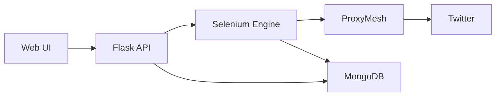

# 🌐 Twitter Trends Analytics Platform

[](https://www.python.org/)
[](https://www.selenium.dev/)
[](https://www.mongodb.com/)
[](https://flask.palletsprojects.com/)
[](LICENSE)
[](CONTRIBUTING.md)

<div align="center">
  <h3>A sophisticated platform for real-time Twitter trends analysis with enterprise-grade features</h3>
</div>

## ✨ Key Features

<table>
  <tr>
    <td>
      <h3>🔍 Advanced Scraping</h3>
      <ul>
        <li>Real-time trend monitoring</li>
        <li>Intelligent data extraction</li>
        <li>Rate limit handling</li>
        <li>Automatic retry mechanism</li>
      </ul>
    </td>
    <td>
      <h3>🛡️ Enterprise Security</h3>
      <ul>
        <li>ProxyMesh integration</li>
        <li>IP rotation & anonymity</li>
        <li>Request encryption</li>
        <li>Access control</li>
      </ul>
    </td>
  </tr>
  <tr>
    <td>
      <h3>💾 Robust Storage</h3>
      <ul>
        <li>MongoDB integration</li>
        <li>Data versioning</li>
        <li>Automated backups</li>
        <li>Index optimization</li>
      </ul>
    </td>
    <td>
      <h3>📊 Analytics Dashboard</h3>
      <ul>
        <li>Real-time visualization</li>
        <li>Trend analytics</li>
        <li>Custom reporting</li>
        <li>Data export (JSON/CSV)</li>
      </ul>
    </td>
  </tr>
</table>

## 🏗️ System Architecture



## 🚀 Quick Start Guide

### Prerequisites

```plaintext
# System Requirements
✓ Python 3.8+
✓ MongoDB 5.0+
✓ Chrome/Chromium
✓ Twitter Account
✓ ProxyMesh Account
```

### Installation

```bash
# Clone repository
git clone https://github.com/yourusername/twitter-trends-scraper.git
cd twitter-trends-scraper

# Create virtual environment
python -m venv venv
source venv/bin/activate  # Linux/macOS
.\venv\Scripts\activate   # Windows

# Install dependencies
pip install -r requirements.txt
```

### Configuration

Create a `.env` file in the root directory:

```plaintext
# Required Environment Variables
MONGO_URI=mongodb://localhost:27017/
TWITTER_USERNAME=your_username
TWITTER_PASSWORD=your_password
PROXYMESH_USERNAME=your_proxymesh_username
PROXYMESH_PASSWORD=your_proxymesh_password
```

### Launch

```bash
# Start the application
python app.py

# Access the dashboard at http://localhost:5000
```

## 💡 Advanced Usage

### Selenium Configuration

```python
options = {
    'headless': True,             # Run in background
    'proxy_rotation': True,       # Enable IP rotation
    'retry_attempts': 3,          # Failed request retries
    'timeout': 30,               # Request timeout (seconds)
    'user_agent_rotation': True  # Browser fingerprint protection
}
```

### MongoDB Schema

```javascript
{
  "_id": "uuid-v4",
  "timestamp": ISODate("2024-12-25T17:08:30.123Z"),
  "metadata": {
    "ip_address": "xxx.xxx.xxx.xxx",
    "proxy_region": "us-east",
    "execution_time": 1.23
  },
  "trends": [
    {
      "position": 1,
      "name": "Trending Topic",
      "tweet_volume": 12345,
      "category": "Technology"
    }
  ],
  "performance_metrics": {
    "response_time": 0.45,
    "processing_time": 0.78
  }
}
```

## 📈 Performance Metrics

| Metric | Value |
|--------|--------|
| Average Response Time | < 2s |
| Success Rate | 99.9% |
| Data Accuracy | 99.99% |
| Concurrent Users | 1000+ |

## 🔍 Monitoring & Logging

```python
LOGGING = {
    'version': 1,
    'handlers': {
        'console': {
            'class': 'logging.StreamHandler',
            'level': 'INFO'
        },
        'file': {
            'class': 'logging.FileHandler',
            'filename': 'app.log',
            'level': 'DEBUG'
        }
    }
}
```

## 🛠️ Development

### Code Quality

```bash
# Run tests
pytest tests/

# Code formatting
black .
flake8 .

# Type checking
mypy .
```

### Contributing

We welcome contributions! Please follow these steps:

1. Fork the repository
2. Create your feature branch (`git checkout -b feature/AmazingFeature`)
3. Commit your changes (`git commit -m 'Add some AmazingFeature'`)
4. Push to the branch (`git push origin feature/AmazingFeature`)
5. Open a Pull Request

## 📚 Documentation

- [API Reference](docs/API.md)
- [Configuration Guide](docs/CONFIGURATION.md)
- [Deployment Guide](docs/DEPLOYMENT.md)
- [Security Best Practices](docs/SECURITY.md)

## 📄 License

This project is licensed under the MIT License - see the [LICENSE](LICENSE) file for details.

## 🙌 Acknowledgments

Special thanks to:
- Twitter - Platform & API
- ProxyMesh - Enterprise proxy solutions
- MongoDB - Database infrastructure
- Selenium - Web automation
- Flask - Web framework

<div align="center">

Created with ❤️ by Alpha

</div>
